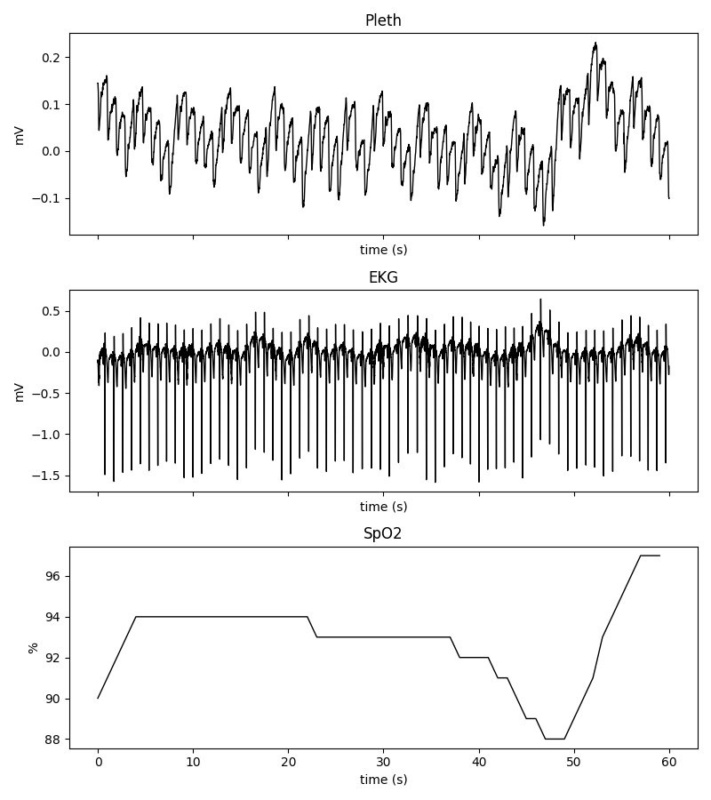

Multimodal Signal Analysis with pyPSG
=======================================

This tutorial provides a detailed walkthrough of multimodal physiological signal analysis using **pyPSG**,
focusing on how different signals (ECG, PPG, HRV, and SpO2) are processed and how biomarkers are derived from them.

Our objectives are to:

- loading and selecting signals from an EDF file
- preprocessing signals
- detecting fiducial points
- extracting biomarkers

This tutorial assumes that you have already completed the setup of **pyPSG**.
For installation and initial configuration, see the example code tutorial.

Download data
-------------

For this tutorial, download the sample dataset from the following repository:

`Sample data (GitHub) <https://github.com/pszabolcsm/pyPSG/tree/main/sample_data>`__

Loading EDF data
----------------

First, select the EDF file containing the physiological signals:

.. code-block:: python

    from pyPSG.utils import select_file

    edf_path = select_file(
        title="Select EDF file",
        filetypes=[("EDF files", "*.edf")]
    )

Next, define the channel names corresponding to the signals in the dataset:

.. code-block:: python

    channels = {
        "ppg": "Pleth",
        "ecg": "EKG",
        "spo2": "SpO2"
    }

Load the selected signals from the EDF file:

.. code-block:: python

    from pyPSG.IO.edf_read import read_edf_signals

    signals = read_edf_signals(edf_path, channels.values())

The signals are stored in a dictionary-like structure, where each entry contains:

.. code-block:: python

    signals["Pleth"]["signal"]   # raw signal values
    signals["Pleth"]["fs"]       # sampling frequency

This structure is used throughout the analysis pipeline.

Visualizing raw signals
-----------------------

After loading the data, plot the raw signals:

.. code-block:: python

    from pyPSG.IO.plot import plot_raw_data

    plot_raw_data(signals)

SpO2 signal processing
----------------------

If a SpO2 channel is available, the signal is processed to extract oxygen saturation biomarkers.

First, retrieve the SpO2 signal and its sampling frequency:

.. code-block:: python

    spo2_signal = signals[channels["spo2"]]["signal"]
    fs = signals[channels["spo2"]]["fs"]

Remove physiologically implausible values (below 50% or above 100%):

.. code-block:: python

    from pobm.prep import set_range

    spo2_signal = set_range(spo2_signal)

Apply a median filter to smooth the signal:

.. code-block:: python

    from pobm.prep import median_spo2

    spo2_signal = median_spo2(spo2_signal, FilterLength=301)

Create a corresponding time axis:

.. code-block:: python

    import numpy as np

    time_signal = np.arange(0, len(spo2_signal)) / fs

Finally, compute SpO2 biomarkers:

.. code-block:: python

    from pyPSG.biomarkers.get_spo2_bm import extract_biomarkers_per_signal

    spo2_bm = extract_biomarkers_per_signal(
        signal=spo2_signal,
        patient="Patient 1",
        time_begin=time_signal[0],
        time_end=time_signal[-1]
    )

The resulting biomarkers are stored for later use.

PPG signal processing
---------------------

If a PPG channel is available, the signal is processed to extract morphological
features and derive physiological biomarkers.

Prepare the signal
^^^^^^^^^^^^^^^^^^

Wrap the raw signal and its metadata into a structured object:

.. code-block:: python

    from dotmap import DotMap

    ppg_signal = DotMap()
    ppg_signal.v = signals[channels["ppg"]]["signal"]
    ppg_signal.fs = signals[channels["ppg"]]["fs"]
    ppg_signal.start_sig = 0
    ppg_signal.end_sig = len(ppg_signal.v)
    ppg_signal.name = "custom_ppg"

Preprocessing
^^^^^^^^^^^^^

Apply bandpass filtering and smoothing to obtain different signal representations:

.. code-block:: python

    import pyPPG.preproc as PP

    filtering = True
    fL = 0.5
    fH = 12
    order = 4
    sm_wins = {"ppg": 50, "vpg": 10, "apg": 10, "jpg": 10}

    prep = PP.Preprocess(fL=fL, fH=fH, order=order, sm_wins=sm_wins)

    ppg_signal.filtering = filtering
    ppg_signal.fL = fL
    ppg_signal.fH = fH
    ppg_signal.order = order
    ppg_signal.sm_wins = sm_wins

    ppg_signal.ppg, ppg_signal.vpg, ppg_signal.apg, ppg_signal.jpg = prep.get_signals(s=ppg_signal)

This step generates the filtered PPG signal and its derivatives (VPG, APG, JPG),
which are required for feature extraction.

Fiducial point detection
^^^^^^^^^^^^^^^^^^^^^^^^

Detect characteristic points in the PPG waveform:

.. code-block:: python

    import pyPPG.fiducials as FP
    from pyPPG import PPG, Fiducials

    s = PPG(s=ppg_signal, check_ppg_len=True)

    fpex = FP.FpCollection(s=s)
    ppg_fiducials = fpex.get_fiducials(s=s)

    fp = Fiducials(fp=ppg_fiducials)

Fiducial points represent key landmarks in the waveform (e.g., systolic peak,
dicrotic notch), which are essential for further analysis.

Biomarker extraction
^^^^^^^^^^^^^^^^^^^^

Compute morphological biomarkers from the PPG signal:

.. code-block:: python

    import pyPPG.biomarkers as BM
    from pyPPG import Biomarkers

    bmex = BM.BmCollection(s=s, fp=fp)
    bm_defs, bm_vals, bm_stats = bmex.get_biomarkers()

    ppg_bm = Biomarkers(
        bm_defs=bm_defs,
        bm_vals=bm_vals,
        bm_stats=bm_stats
    )

ECG signal processing
---------------------

If an ECG channel is available, the signal is processed to detect cardiac events
and extract clinically relevant biomarkers.

Preprocessing
^^^^^^^^^^^^^

Apply filtering to remove powerline interference and noise:

.. code-block:: python

    from pecg import Preprocessing as Pre

    pre = Pre.Preprocessing(
        signals[channels["ecg"]]["signal"],
        signals[channels["ecg"]]["fs"]
    )

    # Remove powerline noise (50 Hz in Europe, 60 Hz in the US)
    filtered_signal = pre.notch(n_freq=50)

    # Apply bandpass filtering to remove baseline wander and high-frequency noise
    filtered_signal = Pre.Preprocessing(
        filtered_signal,
        signals[channels["ecg"]]["fs"]
    ).bpfilt()

This step ensures that the ECG signal is clean and suitable for peak detection.

Fiducial point detection
^^^^^^^^^^^^^^^^^^^^^^^^

Detect R-peaks and compute fiducial points:

.. code-block:: python

    from pecg.ecg import FiducialPoints as Fp

    fp = Fp.FiducialPoints(
        filtered_signal,
        signals[channels["ecg"]]["fs"]
    )

    # Detect peaks using the jqrs algorithm
    jqrs_peaks = fp.jqrs()

    # Compute fiducial points using the Wavedet algorithm (MATLAB Runtime required)
    ecg_fiducials = fp.wavedet(matlab_path, peaks=jqrs_peaks)

The Wavedet algorithm relies on MATLAB Runtime and is used to extract
detailed ECG fiducial points.

Biomarker extraction
^^^^^^^^^^^^^^^^^^^^

Compute interval- and waveform-based biomarkers:

.. code-block:: python

    from pecg.ecg import Biomarkers as Bm

    bm = Bm.Biomarkers(
        filtered_signal,
        signals[channels["ecg"]]["fs"],
        ecg_fiducials
    )

    ints, stat_i = bm.intervals()
    waves, stat_w = bm.waves()

    ecg_bm = {
        "ints": ints,
        "stat_i": stat_i,
        "waves": waves,
        "stat_w": stat_w,
    }

Heart rate variability (HRV) analysis
-------------------------------------

Heart rate variability (HRV) quantifies fluctuations in the time intervals
between successive cardiac cycles.

In this analysis, HRV is derived from both ECG and PPG signals using peak-to-peak intervals.

ECG-based HRV
^^^^^^^^^^^^^

HRV computed from ECG signals is based on the intervals between successive heartbeats:

.. code-block:: python

    rr_intervals = np.diff(jqrs_peaks) / signals[channels["ecg"]]["fs"]

Compute HRV metrics:

.. code-block:: python

    from pyPSG.biomarkers import hrv_bms as hrv

    hrv_bm = hrv.get_all_metrics(rr_intervals, 30)

PPG-based HRV
^^^^^^^^^^^^^

HRV can also be approximated from the PPG signal by analyzing the intervals
between successive pulse peaks:

.. code-block:: python

    ppg_peaks = ppg_fiducials.sp

Compute the intervals between consecutive peaks:

.. code-block:: python

    rr_intervals = np.diff(ppg_peaks) / signals[channels["ppg"]]["fs"]

Compute HRV metrics:

.. code-block:: python

    ppg_hrv_bm = hrv.get_all_metrics(rr_intervals, 30)

This completes the multimodal analysis pipeline,
demonstrating how physiological signals can be processed and transformed into meaningful biomarkers.